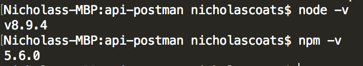

# Opionated API Test Runner using Postman and Newman

Opinionated Test Runner built on [newman](https://github.com/postmanlabs/newman) to help test APIs using Postman collections.

Includes an example API and collection using [express].

[License](LICENSE.md)

>Prerequisites:
```
> node -v
> npm -v
```


>Quick Start Demo: 
```
> git clone https://github.com/coatsnmore/postman-runner
> npm install && npm run start
> npm run test
```
## Project Intentions:

- [ ] provide temporary values e.g. access tokens
- [x] conditional flow APIs e.g. POST then GET [solved with `postman.setNextRequests`] 
- [ ] switch environments
- [ ] run multiple collections
- [ ] test coverage against oas
- [ ] import OAS to bootstrap collection
- [ ] bootstrap includes best practicess
- [ ] bootstrap oAuth helpers
- [ ] distribute as package?
- [ ] CLI interface
- [ ] Sonar results
- [ ] Jenkins results

## References:

* [Conditional Flow in Postman](http://blog.getpostman.com/2016/03/23/conditional-workflows-in-postman/)
* [Example conditional flow script](https://documenter.getpostman.com/view/583/coopers-meal-plan/4u2#2a002172-968a-747f-f1fc-02543aabf81e)